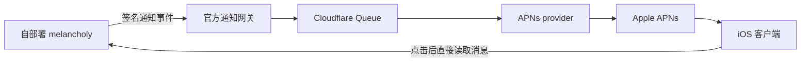

# iOS 客户端与通知服务方案

状态：产品与架构提案，尚未实现 iOS App 或通知网关。核对日期：2026-09-28。

当前优先采用 [PWA + Web Push](pwa.md)：自部署工作区直接投递，无需官方通知网关或 Apple Developer 账号。本文保留为未来收费原生客户端的方案。

## 产品与付费

melancholy 可以保留开源、自部署的服务器，同时提供收费的官方 iOS 客户端。MIT 许可证允许商业分发；复用代码时保留相应版权和许可声明。收费客户端的价值可以是原生聊天、多个工作区、线程处理、附件预览、搜索和移动端 agent 任务管理。

建议第一版使用 App Store 买断客户端，通知作为完整客户端的一部分。也可以考虑通过 StoreKit 订阅提供持续更新、同步和云服务，但订阅必须提供持续价值。买断需要用销量、活跃用户、通知频率估算长期服务成本，先小规模验证，再定价。

Apple App Review Guidelines **4.10** 禁止将 Push Notifications 等内置系统能力直接变现，因此不建议提供单独的“付费开启推送”开关。**4.5.4** 要求用户不开通知时 App 仍可使用，也不应在通知中发送敏感或保密信息。App 内销售数字功能通常应使用 In-App Purchase；地区规则和例外在提交前重新核对。此方案不预先保证 App Review 结果。

第一版不需要把自部署后端登录凭据交给官方服务：App 直接连接用户自己的 HTTPS 域名，以用户身份访问聊天 API，登录信息保存在 iOS Keychain。

## 通知路径

由自部署服务器主动向网关发起出站请求。网关不需要持有管理员 token，也不需要轮询或访问用户的自部署服务器。

1. iOS App 请求通知权限，注册 APNs device token。关闭通知不影响聊天。
2. 用户登录自己的服务器后，服务端验证用户身份并签发短期通知注册凭证。网关完成实例密钥和注册凭证校验，将设备与经过验证的实例／用户授权关联，返回不可猜测的投递地址 ID。
3. 自部署服务器在消息事务中写入通知 outbox，投递线程回复、私信、提及，以及 agent 完成／失败事件。只为有访问权限、未静音的收件人创建事件；自己的消息和前台已读消息不应重复提醒。
4. 网关检查实例身份、投递地址归属、短期授权、事件 ID、时间戳、重放与速率限制后入队；同一事件重复发送不会重复通知。
5. APNs 密钥只由官方服务持有，按 App 的 bundle ID / topic 和沙盒／生产环境区分。用 token-based authentication 发起 APNs 请求；先做真实 iPhone 的端到端 PoC，验证 Cloudflare 出站连接、APNs HTTP/2、签名和环境配置。
6. 点击通知后 App 直接向自部署服务器重新验证权限并读取消息。前后台切换都增量同步，不能把 push 当作保证送达的消息通道。

网关可使用 Cloudflare Workers 处理注册与验签、Queues 做异步投递／重试、D1 保存设备与实例注册及最小化的投递状态。APNs 的临时错误退避重试；失效 token（如 410）注销；多次失败进入死信处理，不能无限重发。APNs 是 Apple 的外部服务，无法替换成 Cloudflare 内部组件。

## 隐私与撤销

默认通知文案采用“有新消息”或“Agent 任务已完成”，载荷只包含不透明的事件／导航标识；网关不接收聊天正文、代码、prompt、密钥或完整工具日志。服务仍会看到设备投递信息、事件时间、来源实例和网络元数据，隐私说明必须如实披露。

如以后支持预览，可由自部署服务器加密给设备，在 Notification Service Extension 内解密；需要专门设计设备密钥注册、轮换、多设备和扩展超时的降级流程，不能把“加密”当作无需隐私设计的理由。第一版先不提供正文预览。

设备退出登录、成员被移除、实例取消接入、订阅权限变化时，撤销对应注册。短期授权和主动撤销共同限制失效窗口。推送事件不构成消息读取授权；App 仍以服务器当前权限为准。

实例注册必须验证密钥持有权并限制滥用。不要让未验证的服务器直接指定任意 APNs token 或其他实例用户。通知地址也不能泄漏 APNs token。

## 建议的第一版

- 原生 SwiftUI 客户端：添加 HTTPS 工作区、登录、频道／私聊／线程、发消息／附件、agent 状态与停止任务。
- 通知仅覆盖私信、提及、参与线程回复、agent 完成／失败；在自部署服务器上设置通知规则。
- 一个可选的官方网关，不使用官方 App 的自部署用户无需接入。开源服务器保持独立可用。
- 先验证一台真机的锁屏通知、重装 token 更新、退出撤销、重复投递、多工作区路由，再决定发布和定价。
- 提交 App Review 时提供可访问的演示工作区和审核账号，不要求审核人员部署自己的服务器。

## 官方参考

- [App Review Guidelines：3.1 Payments、3.1.2 Subscriptions、4.5.4 Push、4.10 Monetizing Built-In Capabilities](https://developer.apple.com/app-store/review/guidelines/)
- [Setting up a remote notification server](https://developer.apple.com/documentation/usernotifications/setting-up-a-remote-notification-server)
- [Establishing a token-based connection to APNs](https://developer.apple.com/documentation/usernotifications/establishing-a-token-based-connection-to-apns)
